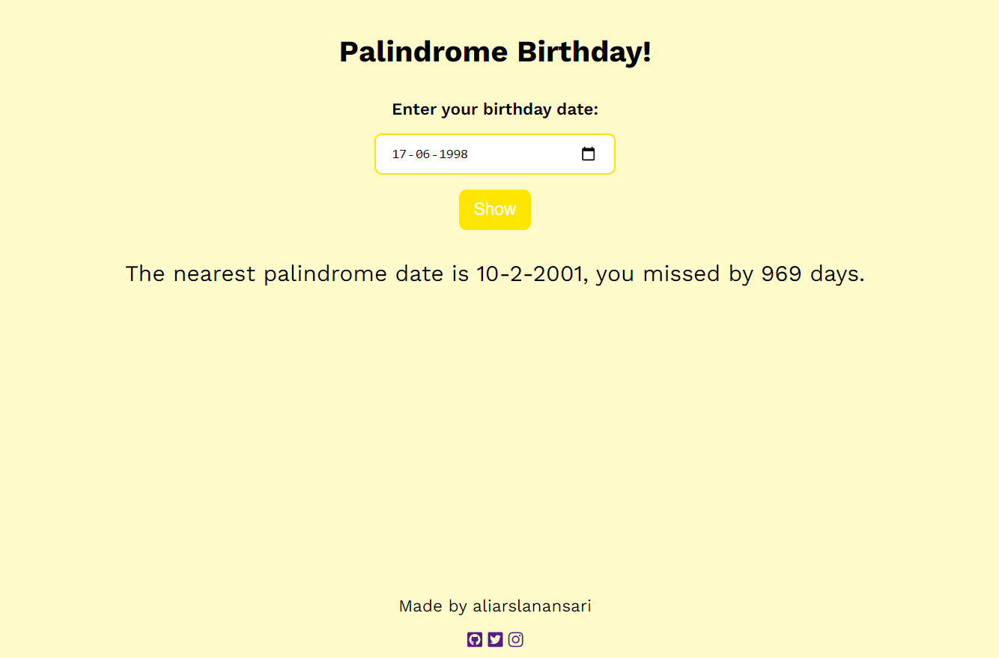

## Mark 13 - Palindrome Birthday 
   
It is developed using Reactjs, [live demo ](https://palindrome-bd.netlify.app/) hosted on vercel. Takes birthday and shows whether it is palindrome or not and tells from how many days we missed it.

#### Features 
- Takes your user's birthday
- Tells whether user was born on a palindrome day or not.
- Uses one of these formats to put dates eg: MM/DD/YYYY, DD/MM/YYYY, MM/DD/YY, etc. Having atleast one date-format out of these is mandatory, adding extra date formats is a bonus.

#### Screenshot

